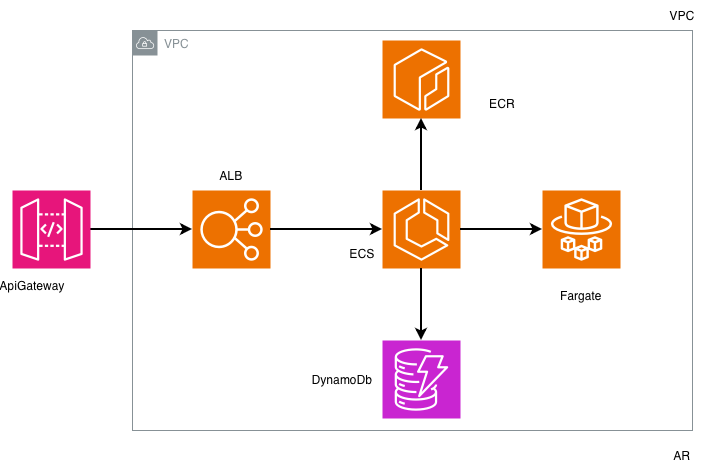

# Nequi Franchises IAC

# Arquitectura




Terraform modules that provision a lightweight serverless-style runtime for a Java container.  
The stack follows the architecture requested by the team:

- **Amazon API Gateway (HTTP API)** terminates public requests.
- **API Gateway VPC Link** forwards traffic to an internal **Application Load Balancer** living inside the VPC.
- The ALB targets an **ECS Fargate** service (3 replicas by default) that pulls the container image from **Amazon ECR**.
- Business data is stored in **Amazon DynamoDB**.

## Project layout

```
environments/
  bootstrap/          # Creates the S3 bucket + DynamoDB table used as Terraform backend
  dev/                # Root module wiring all components together
modules/
  api_gateway/        # HTTP API + VPC link
  container_registry/ # ECR repository
  dynamodb_table/     # DynamoDB table
  ecs_service/        # ECS cluster, task definition and service
  load_balancer/      # Internal application load balancer
  network/            # VPC, subnets, NAT (optional)
  state_backend/      # S3 bucket + DynamoDB table for Terraform remote state
```

Each module follows the patterns from the `iac-components` references, keeping variables, outputs and version pinning in dedicated files.

## Getting started

1. Bootstrap the remote backend (only once per account). Copy `environments/bootstrap/terraform.tfvars.example` and run:

```bash
cd environments/bootstrap
terraform init
terraform apply
```

This creates the S3 bucket and DynamoDB table referenced by the backend configuration.

2. Update `environments/dev/terraform.tfvars` (copy the `*.example` file) with project specific values such as AWS region, subnet CIDRs and naming.
3. From the `environments/dev` directory run:

```bash
terraform init
terraform plan
```

4. Once the plan looks good, apply it:

```bash
terraform apply
```

The outputs include the API Gateway invoke URL, ECR repository URL and ECS service identifiers. Push your Java image to the provided ECR repository URL before switching traffic in production.

## CI/CD

Two GitHub workflows live under `.github/workflows`:

- `terraform.yml` validates every pull request touching `nequi-franchises-iac/**`, runs `terraform plan`, and applies to the remote backend whenever changes hit `main` (after an environment approval). Set the `AWS_TERRAFORM_ROLE` secret with a role that has permissions to manage the state bucket/table and deploy infrastructure.
- `backend.yml` builds the Spring Boot jar, produces a linux/amd64 container via Buildx, pushes it to ECR, and forces a new ECS deployment. Configure the `AWS_DEPLOY_ROLE` secret with a role that can push to the repository and update the ECS service.

## Notes

- The ECS task role ships with least-privilege access to the DynamoDB table created in the same stack.
- NAT Gateway creation can be disabled via `enable_nat_gateway = false` if outbound internet connectivity is not required for the service.
- The API Gateway VPC link and ALB share the private subnets created by the `network` module. Extend the module or add additional resources if you need public entry points or extra security controls.
- Defaults lean on performance-and-cost good practices derived from the bank templates: CloudWatch logs keep two years of history, the ECS cluster registers Fargate Spot capacity by default, and the ECR repository expires older images keeping the most recent releases.
